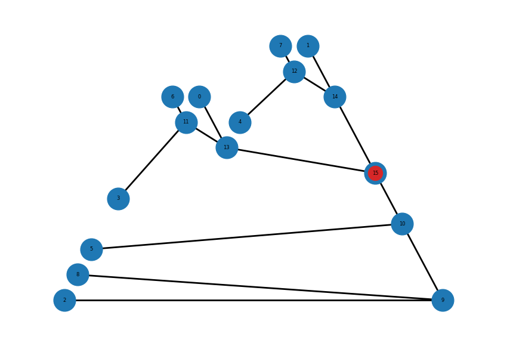

# Grid Topology Estimation Using (Destributed Energy Resources) DER meter data


## Description

There are two steps involved to reconstruct the smart grid topology, assume the graph is radial. 

- Step 1: Import the raw data of smart meter containing phase angle $\phi$, current $I$ and voltage $V$ data, and solve for the pairwise node distance matrix $D_r$ and $D_x$ using the technique presented in Section A of [Topology Identification of Radial Distribution Networks Using Smart Meter Data
]([https://ieeexplore.ieee.org/document/9641748]).

- Step 2: Based on the [Neighbor Joining technique
]([https://www.tenderisthebyte.com/blog/2022/08/31/neighbor-joining-trees/]), we reconstruct the grid topology based on $D_x$

## Getting Started

The smart meter raw data is places in ```data/ Load_Current_Voltage_PF.xlsx```

### Installing

* Set the working directory at the current project folder in command line. 
* Run the following command within your conda environment to install neccessary packages:
```
pip install requirements.txt
```
### Executing program

* Step1: Run <code> rebuilt_code_part1.ipynb </code>
* Step1: Run <code> rebuilt_code_part2.ipynb </code>

### Result


<p align="center">

<br> The estimated grid topology. The root node is marked in red color.
</p>

## Authors

[@DWalter](walter.liao@monash.edu)
